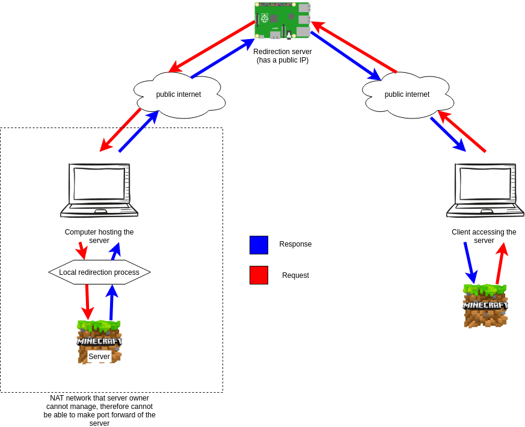

#Minecraft Redirector
Deploy server using a public node as the middle man.

###Why?
You might say that there are easier solutions like making port-forward on the router or something like that.
But in my case it would not work because the computer hosting the server is over a network that I cannot manage.

So using a public node (node with a public IP address) is a logical solution.

Now you ask, why having this trouble?, put the Minecraft server on the public machine and that's done. It's a nice solution
but only when the public node is powerful enough to have a minecraft server running (remember that a minecraft server uses Java and Java eats a LOT of RAM).
This solution enables that low powered devices (like a OrangePI Zero that only has 512Mb of RAM) to act as the public node.

**Portforward is still needed if the public node is over a local home network**, the public node must be in a network that you can manage or hosted
in a external system with a public IP attributed

###How it works?
Its pretty easy and intuitive, you have a client that connects to the public node, the public node redirects the request to the machine hosting the Minecraft server and that's it, a client can connect to the minecraft server from anywhere.

Initially the redirection server is started. The redirection server waits for a connection from the *Local Redirection Process*, so the next step is to start the *Local Redirection Process* on the computer that is hosting the process (at this moment the minecraft server should be already running), when the *Local Redirection Process* starts it sends a connection request to the Redirection Server and the connection is established.
The redirection server then waits for a client to connect, when the connection is achieved all the client requests are redirected to the Minecraft server as if it was connected directly to the server.
The redirection server is a kind of Man in the Middle as it seats on the middle of the connection.
 